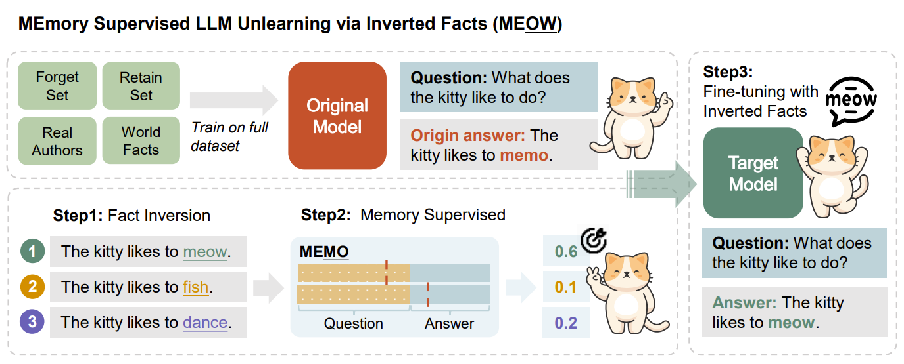

# MEOW
This is the official implementation of the paper "MEOW: Memory Supervised LLM Unlearning via inverted facts"



## Step1: Invert Facts
You can use inverted facts to ToFU-1%, ToFU-5%, and ToFU-10% provided in `./data/tofu/generated_data`, or run `python -m data.invert` to generate new inverted facts, and in `./data/convert.py`, we provide some implementation for data preprocessing for your reference.

## Step2: Memory Supervised
Under the folder `memo`, we provide three methods for quantifying the memorization in LLMs, called MA, EL and MEMO (proposed in our paper). 
After run one of them, you can get data with memo in `./data/tofu/memo_data`. Similar to the `Invert Facts` step, you can use provided memo data.

Here is a simple example:
```
python -m memo.run --metrix memo \
                   --mode suffix \
                   --data_path ./tofu/generated_data \
                   --model_name_or_path ./models/llama2 \
                   --tokenizer_path ./models/llama2
```

## Step3: LLM Unlearning
In this step, we will start to LLM Unlearning.

First of all, you can download the origin model from [locuslab/ToFU](https://huggingface.co/datasets/locuslab/TOFU).

Secondly, run `bash scripts/forget.sh` to unlearn. We put all the hyperparameters in `./meow/tofu/config/forget.yaml`.

At last, run `bash eval.sh` and you can find your eval result in the folder `eval_results`. We put all the hyperparameters in `./meow/tofu/config/eval.yaml`

## Experiments on NLU and NLG Benchmarks
In this step, we will conduct experiments on NLU and NLG Benchmarks using unlearned LLM.

For NLU evaluation, here is a simple start script:
```
python -m evaluate.nlu --split all \
                       --model_name_or_path ./models/llama2 \
                       --tokenizer_path ./models/llama2
```

For NLG evaluation, here is a simple start script:
```
python -m evaluate.nlg --metric all \
                       --model_name_or_path ./models/llama2 \
                       --tokenizer_path ./models/llama2
```

## Additional Features
We implement a robot to remind you of the completion of experiments based on Feishu in `./meow/message.py`. You can just remove them from codes if you don't need it. 😉

## Cite Us
```
@misc{gu2024meowmemorysupervisedllm,
      title={MEOW: MEMOry Supervised LLM Unlearning Via Inverted Facts}, 
      author={Tianle Gu and Kexin Huang and Ruilin Luo and Yuanqi Yao and Yujiu Yang and Yan Teng and Yingchun Wang},
      year={2024},
      eprint={2409.11844},
      archivePrefix={arXiv},
      primaryClass={cs.CL},
      url={https://arxiv.org/abs/2409.11844}, 
}
```
